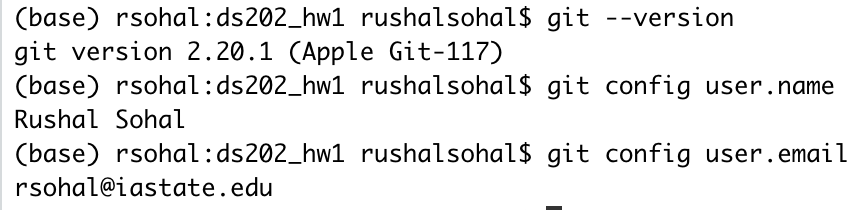

```{r setup, include=FALSE}
knitr::opts_chunk$set(echo = TRUE)
```

##### **Q3.**
The job of a data scientist would be to get data and make the most efficient use of it to predict the future. For instance, a recent research topic, **predictive machine maintenance** is something a data scientist could do (and interests me as well). The idea is to collect data from machines (atleast 2yrs) and effectively use it to predict when it needs a maintenance/service or when it could fail.

*You could read more about predictive maintenance [here](https://en.wikipedia.org/wiki/Predictive_maintenance)*


```{r pressure, echo=FALSE, fig.cap="*Image showing my feelings for data science*", out.width = '25%'}

```

##### **Q4.**
```{r}
version
```

##### **Q5, Q6, Q7.**
```{r, echo=FALSE, fig.cap="", out.width = '50%'}

```

##### **Q8.**
Username: ***rushalsohal***
